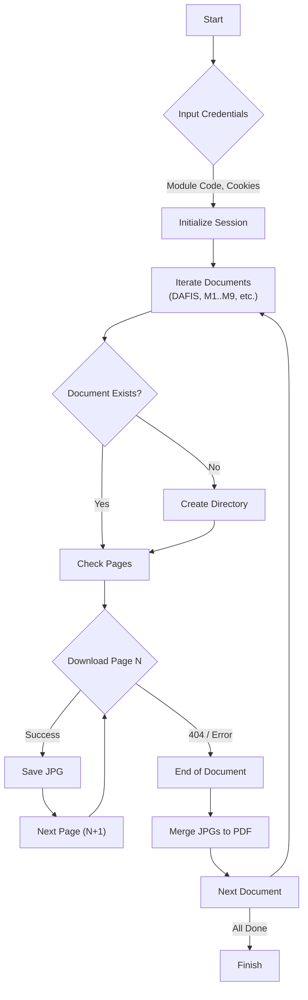

# RBV Downloader

A concise Python tool to download course materials from **Ruang Baca Virtual (RBV) - Pustaka UT** and automatically merge them into PDF files.

## Features

- Downloads all module sections (DAFIS, TINJAUAN, M1-M9).
- Automatically merges downloaded JPG pages into a single PDF for each section.
- Resumes downloads if interrupted (skips existing files).

## Prerequisites

- Python 3.x
- `pip` (Python package installer)

## Installation

1. Clone or download this repository.
2. Install the required dependencies:
   ```bash
   pip install -r requirements.txt
   ```

## How to Run

1. Run the script:
   ```bash
   python download_images.py
   ```
2. Enter the **Module Code** (e.g., `ADBI421103`).
3. Enter your **PHPSESSID** and **Sucuri Cookie**.

   - Example PHPSESSID: `e7mvf4g1j0knkuq06d6631ktjt`
   - Example Sucuri Cookie: `sucuricp_tfca_6e453141ae697f9f78b18427b4c54df1=1`

   **How to get them:**

   1. Login to [RBV Pustaka UT](https://pustaka.ut.ac.id/reader/).
   2. Open Developer Tools (F12 or Right Click -> Inspect).
   3. Go to the **Application** tab (Chrome/Edge) or **Storage** tab (Firefox).
   4. Expand **Cookies** and select the site URL.
   5. Copy the values for `PHPSESSID` and the cookie starting with `sucuricp_tfca_...`.

## Workflow



## Output Structure

```
downloads/
└── <MODULE_CODE>/
    ├── DAFIS.pdf
    ├── M1.pdf
    ├── ...
    ├── DAFIS/       # Raw images
    ├── M1/          # Raw images
    └── ...
```
