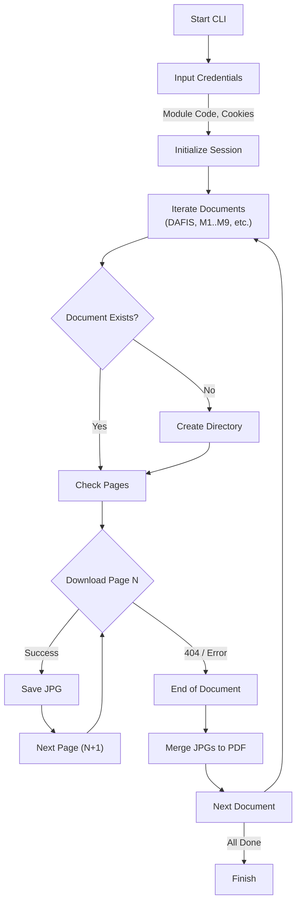
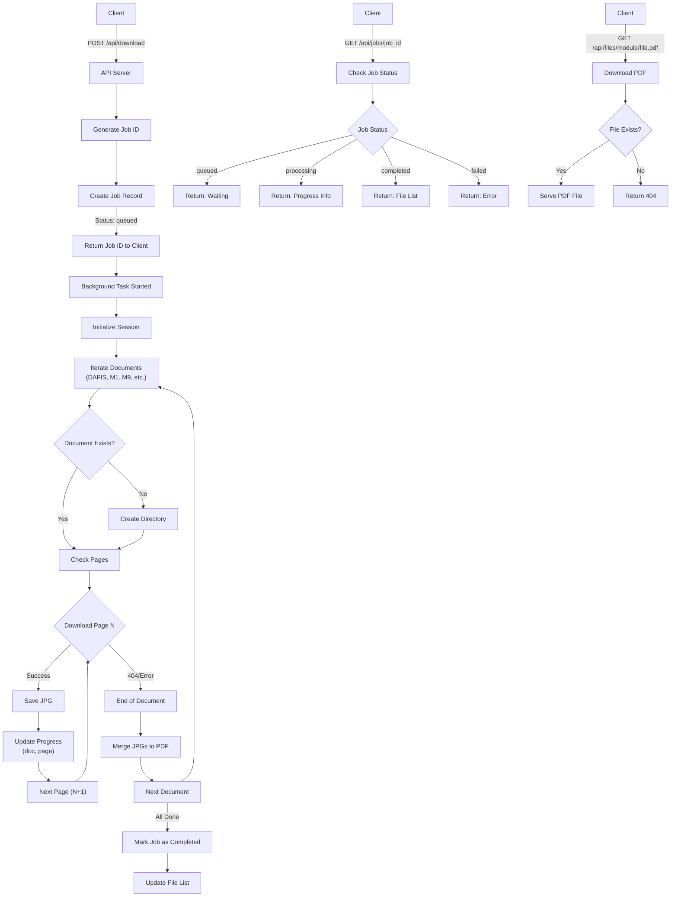

# RBV Downloader

A concise Python tool to download course materials from **Ruang Baca Virtual (RBV) - Pustaka UT** and automatically merge them into PDF files.

## Features

- Downloads all module sections (DAFIS, TINJAUAN, M1-M9).
- Automatically merges downloaded JPG pages into a single PDF for each section.
- Resumes downloads if interrupted (skips existing files).
- **API Service** for asynchronous job processing with job management and file serving.
- **Graphical User Interface (GUI)** for easy interaction and download management.

## Prerequisites

- Python 3.x
- `pip` (Python package installer)

## Installation

1. Clone or download this repository.
2. Install the required dependencies:
   ```bash
   pip install -r requirements.txt
   ```
   *Note: If you encounter issues with `tkinter` on macOS, run `brew install python-tk@3.14` (replace `3.14` with your Python version).*

## Building & Releasing

For instructions on how to build standalone executables for Windows, macOS, and Linux using GitHub Actions, please refer to the [RELEASE.md](RELEASE.md) guide.

## How to Run

### Option 1: CLI Mode

1. Run the script:
   ```bash
   python download_images.py
   ```
2. Enter the **Module Code** (e.g., `ADBI421103`).
3. Enter your **PHPSESSID** and **Sucuri Cookie**.

   - Example PHPSESSID: `e7mvf4g1j0knkuq06d6631ktjt`
   - Example Sucuri Cookie: `sucuricp_tfca_6e453141ae697f9f78b18427b4c54df1=1`

   **How to get them:**

   1. Login to [RBV Pustaka UT](https://pustaka.ut.ac.id/reader/).
   2. Open Developer Tools (F12 or Right Click -> Inspect).
   3. Go to the **Application** tab (Chrome/Edge) or **Storage** tab (Firefox).
   4. Expand **Cookies** and select the site URL.
   5. Copy the values for `PHPSESSID` and the cookie starting with `sucuricp_tfca_...`.

### Option 2: API Service

The downloader can also be run as an API service for asynchronous job processing.

#### Starting the API Server

Run the API server using the provided script:
```bash
./run_api.sh
```

Or manually with uvicorn:
```bash
uvicorn app.main:app --reload --host 0.0.0.0 --port 8000
```

The API will be available at `http://localhost:8000`

#### API Endpoints

##### 1. Start a Download Job

**POST** `/api/download`

Start a background download job for a module.

**Request Body:**
```json
{
  "module_code": "ADBI421103",
  "phpsessid": "e7mvf4g1j0knkuq06d6631ktjt",
  "sucuri_cookie": "sucuricp_tfca_6e453141ae697f9f78b18427b4c54df1=1"
}
```

**Response:**
```json
{
  "job_id": "550e8400-e29b-41d4-a716-446655440000",
  "status": "queued"
}
```

**Example using curl:**
```bash
curl -X POST http://localhost:8000/api/download \
  -H "Content-Type: application/json" \
  -d '{
    "module_code": "ADBI421103",
    "phpsessid": "your_phpsessid",
    "sucuri_cookie": "your_sucuri_cookie"
  }'
```

##### 2. Check Job Status

**GET** `/api/jobs/{job_id}`

Check the status and progress of a download job.

**Response:**
```json
{
  "id": "550e8400-e29b-41d4-a716-446655440000",
  "module_code": "ADBI421103",
  "status": "processing",
  "progress": {
    "status": "processing",
    "doc": "M1",
    "page": 15,
    "message": "Downloading page 15"
  },
  "files": []
}
```

**Status values:**
- `queued` - Job is waiting to start
- `processing` - Job is currently downloading
- `completed` - Job finished successfully
- `failed` - Job encountered an error

**Example using curl:**
```bash
curl http://localhost:8000/api/jobs/550e8400-e29b-41d4-a716-446655440000
```

##### 3. Download Generated PDF

**GET** `/api/files/{module_code}/{filename}`

Download a generated PDF file.

**Example using curl:**
```bash
curl -O http://localhost:8000/api/files/ADBI421103/M1.pdf
```

**Example in browser:**
```
http://localhost:8000/api/files/ADBI421103/M1.pdf
```

### Option 3: GUI Mode

The downloader now includes a Graphical User Interface for easier interaction.

#### Running the GUI

1.  **From Source:**
    Ensure all dependencies are installed (`pip install -r requirements.txt`). Then, run:
    ```bash
    python3 gui.py
    ```
2.  **Using a Standalone Executable:**
    First, you need to build the executable.
    ```bash
    ./build_app.sh
    ```
    This script will install `pyinstaller` (if not already installed) and compile the application.
    *   **macOS**: The executable will be found in `dist/RBV_Downloader.app` (or `dist/RBV_Downloader`). Double-click to run.
    *   **Linux**: If built on Linux, the executable will be `dist/RBV_Downloader`. Run it from your terminal.
    
    *Note: PyInstaller builds an executable for the operating system it is run on. To get a Linux executable, you must build it on a Linux machine.*

#### Configuration and Download Location

The GUI allows you to enter your Module Code and cookies directly. These settings, along with your preferred download location, are automatically saved to `config.json` after your first download, so you don't have to re-enter them.

*   **Download Path**: By default, files will be saved to `~/Downloads/RBV-Downloader/` (within your user's Downloads folder). You can customize this path using the "Browse" button in the application. Files for each module will be organized into subfolders within this chosen path.

## Workflow

### CLI Mode Workflow



### API Mode Workflow



## Output Structure

Downloaded files are organized within the chosen download directory as follows:

```
<Chosen Download Path>/
└── <MODULE_CODE>/
    ├── DAFIS.pdf
    ├── M1.pdf
    ├── ...
    ├── DAFIS/       # Raw images
    ├── M1/          # Raw images
    └── ...
```